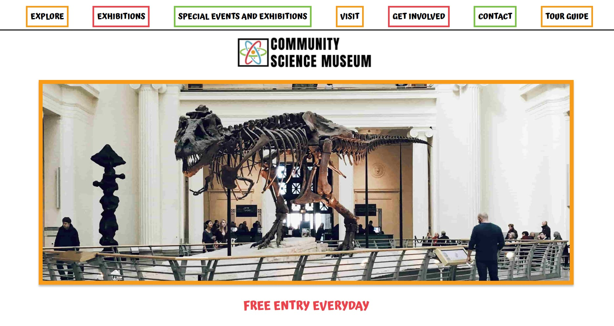

# SEMESTER PROJECT 1

 The website created for Semester Project 1 - Community Science Museum. An engaging, informative, and user friendly website for a new interactive science museum opening in the city.

# Description:

This project involves designing and developing a responsive, user-friendly, and visually engaging website for the newly established Community Science Museum, aimed at children aged 7–15 and families with young children. The goal of the site is to inform and excite the public about the museum, encourage visits, and showcase its interactive exhibits and educational events.

The website is a static site built using HTML and CSS, with an emphasis on accessibility, mobile responsiveness, clean semantic structure, and adherence to WCAG accessibility guidelines. It is designed to be fast-loading, visually appealing to the target audience, and optimized for SEO.

## Built with:

- HTML 
- CSS
- JS (Added a contact.mjs to ensure all fields in the contact form are filled out.)

## Getting Started 

### Installing

1. Clone the repo: 

https://github.com/camiP89/Semester-Project-1.git

2. Install Live server in VS Code - npm install

### Running

1. Right-click the index.html file and select "Open with live server".

## View my live website which is hosted on Netlify: 

[My live website]https://camip89.github.io/Semester-Project-1/

# Contact

[My email address]campug04041@stud.noroff.no

# Acknowledgments 

- Marvin Poole: Semester Project 1 - Community Science Museum. 

# Project plan 

[https://github.com/users/camiP89/projects/12]

# Designed using Figma

[https://www.figma.com/design/JzoGBi3ZJhOERLFCmzG3TP/Semester-Project-1--Design?node-id=0-1&t=41sp5HbnDcLoBi1x-1]